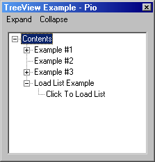



## A TreeView Example By Pio

### Description

This is a really good example showing you how to do the basics with TreeView. ex. Load List, Expand a Node on Run, etc.
 
### More Info
 

             |
---                |---
**Submitted On**   |2002-04-08 17:27:06
**By**             |[Pioneer](https://github.com/Planet-Source-Code/PSCIndex/blob/master/ByAuthor/pioneer.md)
**Level**          |Intermediate
**User Rating**    |4.6 (83 globes from 18 users)
**Compatibility**  |VB 4\.0 \(32\-bit\), VB 5\.0, VB 6\.0
**Category**       |[OLE/ COM/ DCOM/ Active\-X](https://github.com/Planet-Source-Code/PSCIndex/blob/master/ByCategory/ole-com-dcom-active-x__1-29.md)
**World**          |[Visual Basic](https://github.com/Planet-Source-Code/PSCIndex/blob/master/ByWorld/visual-basic.md)
**Archive File**   |[A\_TreeView726584162002\.zip](https://github.com/Planet-Source-Code/pioneer-a-treeview-example-by-pio__1-33865/archive/master.zip)

